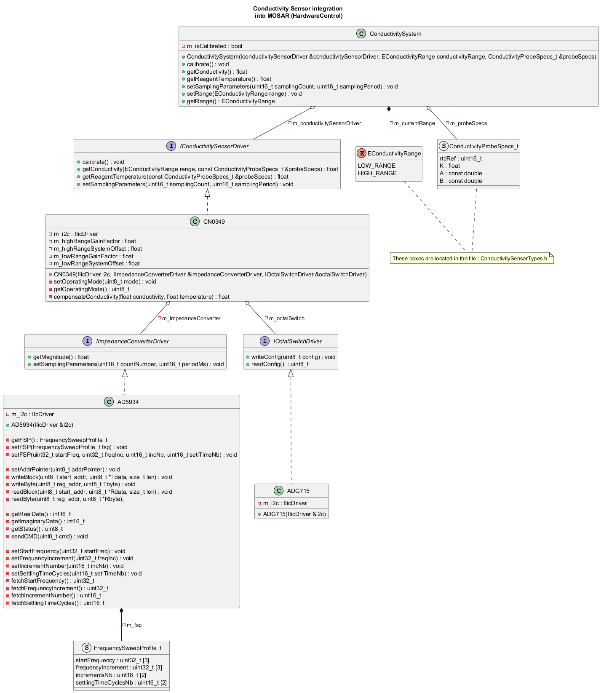
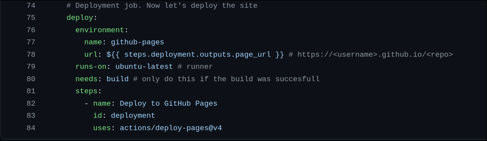
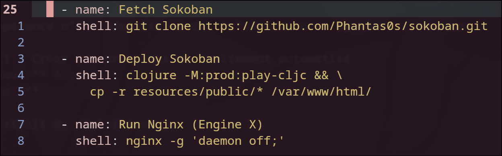
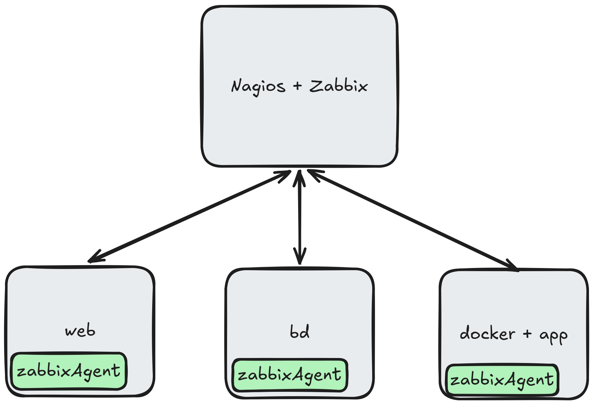
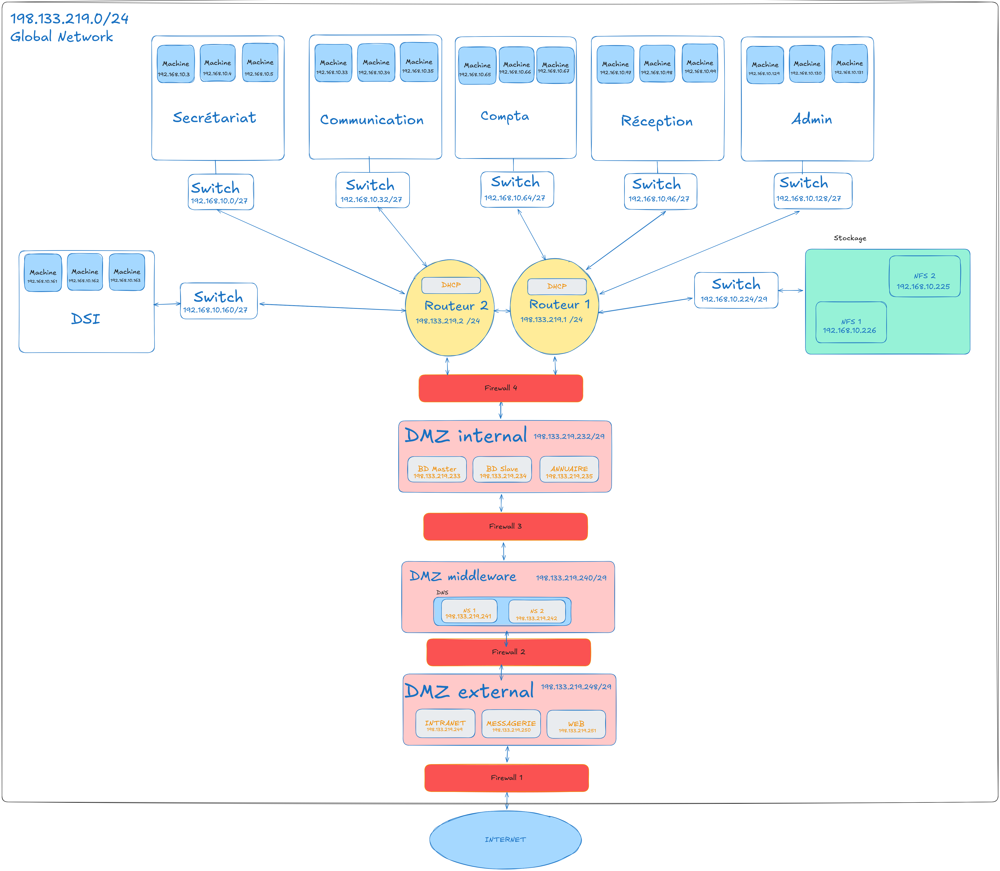
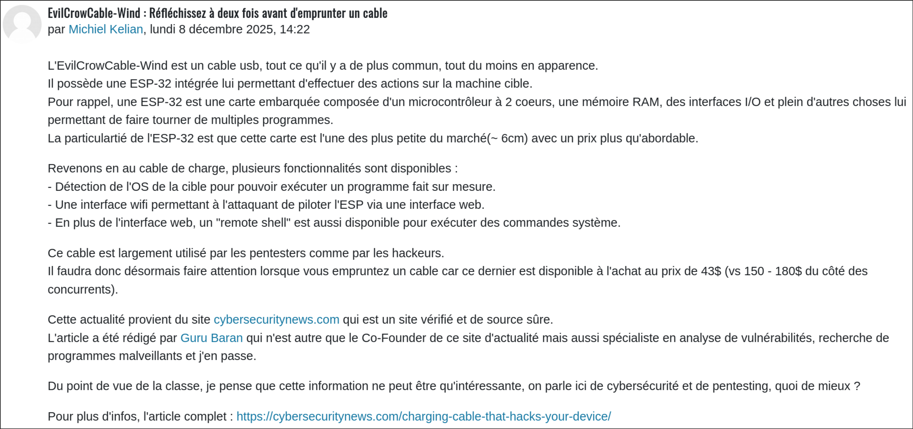
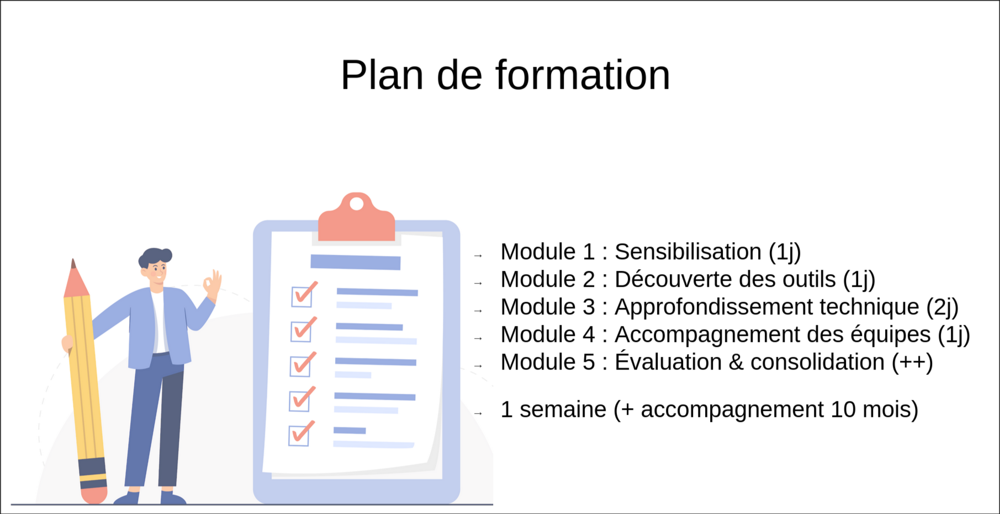

Pour chaque apprentissage critique, vous trouverez un texte descriptif ainsi que les traces associées qui démontrent mon niveau (autoévaluation bien évidemment).

Le niveau suivra l'échelle suivante : **Non-Acquis** ⭢ **En cours d'acquisition** ⭢ **Acquis**

## Compétence n°1 : Réaliser des applications

### AC1 : Choisir et implémenter les architectures adaptées
**Niveau :** Acquis\
**Trace :**

#### Conception POO en C++ :
PS : Cette trace est valable pour les trois AC de la compétence. Je ne la mets qu'une fois dans la mesure où elle est colossale et prends pas mal de place. Il faut donc se réferrer à ce diagramme pour les explications / justifications suivantes.
\
Ce diagramme de classe a été conceptualisé dans l'optique d'intégrer un driver de capteur de conductivité à une architecture déjà existante. Il implémente un **pattern façade**, pattern figurant dans les designs patterns du GoF. Ce pattern permet de décomplexifier l'utilisation d'un objet en rajoutant une abstraction par dessus (une façade). La façade ici est représentée par la classe **ConductivitySystem** rassemblant les éléments essentiels au bon fonctionnement du capteur de conductivité.

### AC2 : Faire évoluer une application existante
**Niveau :** Acquis\
**Trace :**
Se réferrer au diagramme de classe de la trace correspondant à l'AC1 (juste au dessus).\
Ce driver a été intégré a un framework développé en interne du nom de MOSAR (Médical Open System ARchitecture) chez HORIBA Médical. Il visait donc à améliorer ce framework et donc le faire évoluer par la même occasion. Il est actuellement développé pour un projet en particulier mais vise à améliorer le framework dans la mesure où il pourra être réutilisé par la suite.

### AC3 : Intégrer des solutions dans un environnement de production
**Niveau :** En cours d'acquisision\
**Trace :**

#### Extrait du script de déploiement du site web statique sur lequel vous vous trouvez :

\
Peut on considérer mon site de portfolio comme un environnement de production ? Si oui, alors je fais continuellement de l'intégration de solution dans un environnement de production au travers de GitHub Pages qui me permet **on push** d'updater mon site web statique écrit en go et rédigé en markdown grâce au super framework qu'est Hugo.\
Je laisse cependant le niveau **En cours d'acquisition** car ce n'est pas un environnement ni même quelquechose de très complexe à réaliser. Je pense que l'on peut aller bien plus loin que cela concernant cette AC.

## Compétence n°3 : Administrer des infrastructures systèmes / réseaux

### AC1 : Créer des processus de traitement automatisé
**Niveau :** Acquis\
**Trace :**

#### Extrait d'un playbook ansible
\
Durant les Tds de **services complexes** nous avons pu expérimenter de nombreux outils de déploiement dont ansible, puppet, chef ainsi que terraform. Ici, un extrait d'un playbook ansible déployant le jeu sokoban développé en clojure par Matthieu Cneude (@Phantas0s) sur un serveur nginx. Ce déploiement est entièrement automatisé via l'outil ansible. Une simple commande **ansible play-book deploy_sokoban.yml** permet le déploiement de ce magnifique jeu vimBindings friendly.

### AC2 : Configurer un serveur et des services réseaux de manière avancée
**Niveau :** Acquis\
**Trace :**

#### Extrait d'un vagrant file

Lors de ce TD, nous avons du monitorer plusieurs services avec deux outils : Nagios et Zabbix. Le but étant de les tester pour voir comment ils fonctionnaient. Pour ce faire, nous avons du configurer 4 VMs. La première étant la VM de supervision avec zabbix server et Nagios server d'installé. Les trois autres contenaient les services à superviser. Les services sont un serveur web, un serveur base de données ainsi qu'une application plus générique. On retrouve, sur la trace à l'appui, la structure des VMs ainsi que leurs intéractions. Elles appartiennent toutes au même réseau mais ne se voient pas entre elles. Il y a simplement la VM de supervision capable de voir les autres VMs à superviser.

### AC3 : Appliquer une politique de sécurité au niveau de l'infrastructure
**Niveau :** Acquis\
**Traces :**

#### Infrastructure réseaux - Bastion / défense en profondeur

Lors d'un TD, nous avions du mettre en place une infrastructure pour parc informatique avec pour consignes : plusieurs serveurs (web, messagerie, bd, annuaire, nameserver), respecter les délimitations par pôles (Secrétariat, Compta..) mais surtout la plus importante : budget illimité.\
Nous avons donc mis en place une infrastructure robuste, sécuritaire et pérenne. A l'aide de la structure **bastion** et de la philosophie **défense en profondeur**, notre infra comporte des zones bien délimitées. Une dmz interne, une dmz centrale ainsi qu'une dmz externe. Le tout composé de plusieurs firewall permettant le filtrage des accès pour chaque zone.

### AC4 : Déployer et maintenir un réseau d'organisation en fonction de ses besoins
**Niveau :** En cours d'acquisition\
**Trace :**
Je n'ai pas eu l'occasion de maintenir un réseau d'organisation durant mes expériences à l'IUT. Cependant, j'ai pu déployer des réseaux comme des services. Je ne pense pas être un as dans le domaine pour autant.

## Compétence n°6 : Collaborer au sein d'une équipe informatique

### AC1 : Organiser et partager une veille technologique et informationnelle
**Niveau :** Acquis\
**Trace :**
Le partage d'une veille technologique et informationnelle s'est exercée tout au long de ma scolarité et ce sous plusieurs formes. Du bouche à oreille avec mes camarades de classe, via des partages de forums sur les réseaux sociaux ou encore suivant le forum organisé par le cours de communication.

#### Extrait d'un post sur le forum de veille technologique

### AC2 : Identifier les enjeux de l'économie de l'innovation numérique
**Niveau :** Non-Acquis\
**Trace :**
J'aimerai bien fournir une trace mais je n'ai aucune idée de ce que je peux associer à cette AC. Si cette trace fait référence aux cours de management responsable je refuse de lier un quelconque travail. Cette matière ne m'a pas du tout convaincu.

### AC3 : Guider la conduite du changement informatique au sein d'une organisation
**Niveau :** Acquis\
**Trace :**
Cette AC a été travaillée durant de nombreux TDs de **continuité de service** avec l'aide de Francis GARCIA. Des présentation pour améliorer un parc informatique à la mise en place d'un PRA/PCA, tout y est passé.\
De plus, nous avons mis en place, avec l'aide de mes camarades, une formation de transition des logiciels propriétaires aux logiciels libres à destination d'une TPE. (lors d'un td de communication)

#### Transition des logiciels propriétaires vers les logiciels libres

### AC4 : Accompagner le management de projet informatique
**Niveau :** En cours d'acquisition\
**Trace :**
**Projets en relation :** [Rustic](../../projets/rustic)\
Lors du projet [Rustic](../../projets/rustic), nous avons travaillé selon des méthodes itératives suivant un gitlab flow. Les traces se trouvent dans le projet cité.\
Je n'ai pas eu vraiment la chance d' "accompagner le management d['un] projet informatique" mais je pense en avoir cerné les grands principes.

